# Latest Document Automation Platforms Collection (With Detailed Review)

You know that sinking feeling when you're waiting on signatures from three different people and your deal is going cold? Or when you're manually copying contract details into proposals for the hundredth time this month? Document automation platforms solve this chaos by handling everything from creation to signature collection without you needing to chase anyone down. These tools speed up your sales cycle, eliminate data entry errors, and give you real-time visibility into who's actually reading your proposals so you can follow up at exactly the right moment.

## [PandaDoc](https://www.pandadoc.com)

An all-in-one document automation platform combining proposal creation, CPQ functionality, e-signatures, and workflow management for teams closing deals faster.

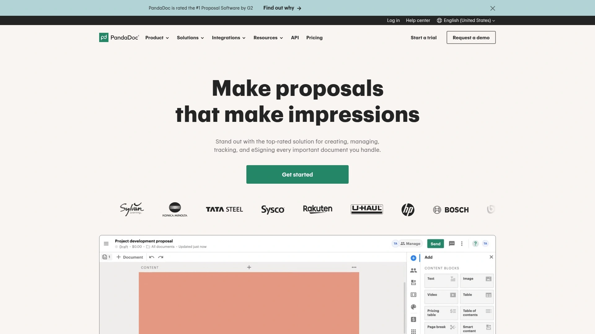

PandaDoc excels by unifying the entire document lifecycle in one place rather than forcing you to stitch together multiple tools. Create professional proposals using drag-and-drop templates, automatically pull pricing data from your CRM, send contracts for signature, and collect payments without leaving the platform. Real-time tracking shows when recipients open documents, which sections they spend time on, and when they're ready to sign, giving your sales team perfect timing for follow-ups.

The platform integrates deeply with major CRMs including Salesforce, HubSpot, and Pipedrive, syncing contact data and deal stages automatically. Approval workflows route documents through your internal review process before they reach clients, maintaining quality control without slowing down sales. Deal rooms create collaborative spaces where teams negotiate terms, share files, and finalize agreements in one organized location.

Custom branding ensures every document reflects your company's identity, from colors and logos to fonts and layouts. The content library stores reusable text blocks, images, and pricing tables that your team can drag into proposals, eliminating the need to recreate common sections. Analytics track proposal performance across your team, revealing which templates convert best and where prospects lose interest.

**Pricing breakdown:** Essentials plan at $19/user monthly (billed annually) includes unlimited e-signatures and documents, drag-and-drop editor, real-time tracking, and 24/7 support. Business plan at $49/user monthly adds CRM integrations, custom quotes, approval workflows, deal rooms, and bulk send capabilities. Enterprise pricing is customized based on volume and feature requirements.

## [DocuSign](https://www.docusign.com)

The industry-standard e-signature solution trusted by large enterprises for its global compliance, extensive integrations, and proven reliability in regulated industries.

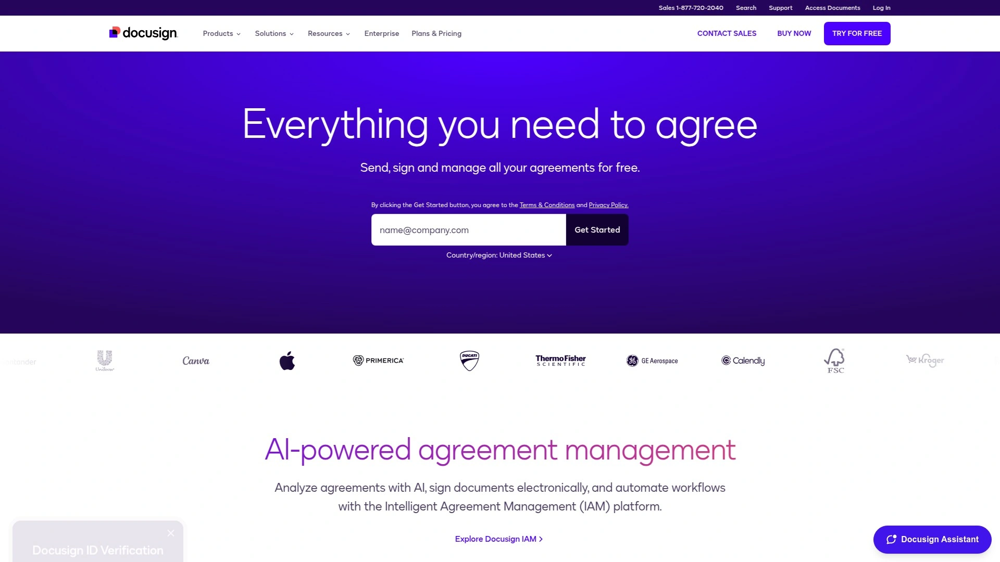

DocuSign pioneered the e-signature space and maintains the largest market share due to its comprehensive approach to compliance and security. The platform meets legal standards across countries including ESIGN in the U.S., eIDAS in Europe, and industry-specific requirements like HIPAA for healthcare and SOC 2 for technology companies. Detailed audit trails capture every action with timestamps, IP addresses, and authentication methods, providing documentation that holds up in legal proceedings.

Bulk sending lets you dispatch hundreds of documents simultaneously with unique recipient information merged automatically. In-person signing accommodates scenarios where multiple parties gather to execute agreements on a single device. Payment collection through Stripe and Square turns signed contracts into immediate revenue without additional steps.

Over 900 integrations connect DocuSign to virtually any business system, from CRMs and project management tools to industry-specific software. Mobile apps provide full functionality on smartphones and tablets, including offline signing that syncs when connectivity returns. The platform's enterprise focus means robust administrative controls for managing users, setting permissions, and enforcing company-wide signing standards.

## [Adobe Sign](https://www.adobe.com/sign.html)

An enterprise-grade e-signature platform deeply integrated with Microsoft 365 and Adobe's document ecosystem, ideal for organizations already using these tools.

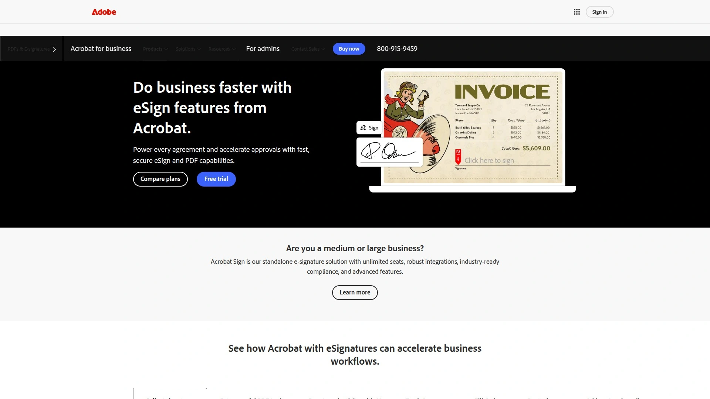

Adobe Sign's strength lies in its seamless integration with Microsoft 365, allowing you to send documents for signature directly from Word, Outlook, Teams, and SharePoint without switching applications. PowerAutomate integration builds automated workflows that trigger signature requests based on specific business events. For companies standardizing on Microsoft's stack, this native functionality eliminates the friction of adopting separate signing tools.

Custom workflows support complex approval chains where documents route through multiple reviewers before reaching external signers. Role-based signing ensures each participant sees only relevant fields and signs in the correct sequence. Automated archiving files completed documents according to company retention policies.

Qualified Electronic Signatures through eIDAS add-on provide the highest level of legal validity in European Union countries, requiring identity verification equivalent to in-person signing. Adobe Sensei AI automatically recognizes form fields in uploaded PDFs and suggests optimal placement for signature blocks, dates, and initials. The platform scales to thousands of users across departments with centralized administration and single sign-on support.

## [Dropbox Sign](https://sign.dropbox.com)

Formerly HelloSign, this straightforward e-signature tool prioritizes simplicity and ease of use while maintaining legal compliance and essential features.

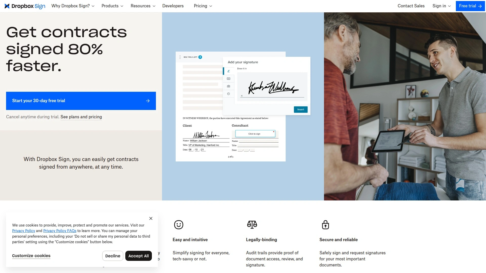

Dropbox Sign strips away complexity to focus on getting documents signed quickly without overwhelming users with options. The interface requires minimal training, making it suitable for teams who need functionality without extensive onboarding. Files sent from Dropbox automatically save signed versions back to the same folder, creating a seamless workflow for organizations already using Dropbox for storage.

Reusable templates convert frequently used documents like NDAs and service agreements into ready-to-send formats with pre-positioned signature fields. Twenty-two language options let recipients review and sign in their preferred language. Qualified Electronic Signatures meeting eIDAS standards include video-based identity verification for maximum security.

API access allows developers to embed signing functionality directly into custom applications and websites. Conditional logic shows or hides fields based on recipient responses, creating dynamic forms that adapt to each situation. Pricing starts at $15/user monthly for essentials, with standard tier at $25/user monthly adding Salesforce integration and bulk send.

## [SignNow](https://www.signnow.com)

A cost-effective e-signature solution offering enterprise features at small business prices, backed by the AirSlate workflow automation ecosystem.

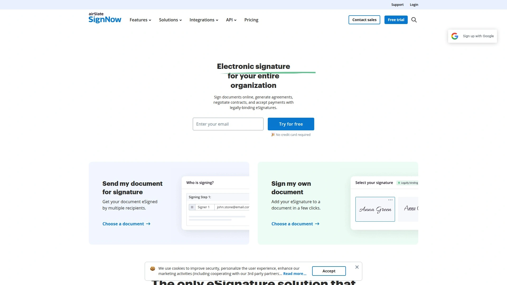

SignNow delivers robust functionality at pricing significantly below DocuSign and Adobe Sign, making enterprise capabilities accessible to smaller organizations. Multiple signing options let recipients draw signatures with a mouse or finger, type their name, or upload an image. Online notarization connects signers with commissioned notaries through video calls, providing legally notarized documents without office visits.

Signing orders define the sequence in which multiple parties must sign, automatically sending documents to the next person once the previous signature is captured. Document expiration dates create urgency and automatically cancel unsigned requests after specified periods. Automated reminders eliminate the need to manually follow up with slow signers.

Custom branding applies your company colors, logo, and messaging to signing pages and email notifications. Plans range from $8/user monthly for basic business features to $30/user monthly for enterprise with advanced security and support. The broader AirSlate platform provides workflow automation tools that extend beyond signatures to full business process management.

## [GetAccept](https://www.getaccept.com)

A digital sales room platform combining proposals, e-signatures, video messages, and mutual action plans to create engaging buyer experiences.

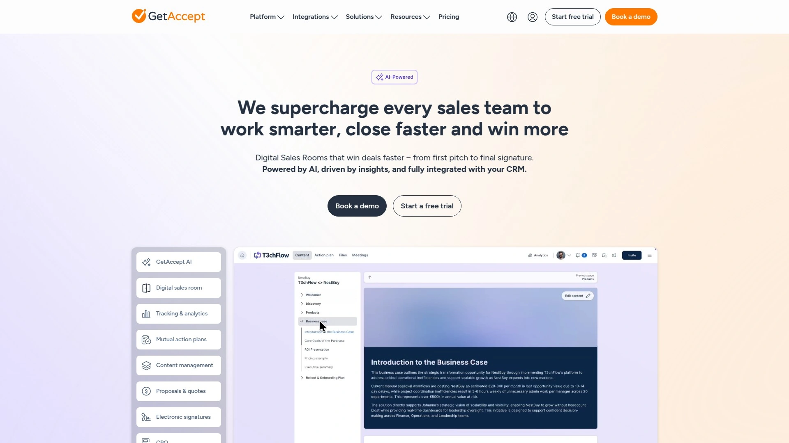

GetAccept goes beyond simple document signing to create interactive spaces where sales teams collaborate with prospects. Video messages embedded in proposals add personal touches that differentiate your outreach from competitors sending static PDFs. Live chat lets sales reps answer questions in real-time as prospects review documents, shortening the consideration phase.

Mutual action plans outline steps both parties must complete to close the deal, creating accountability and momentum. CPQ features ensure accurate pricing in every proposal, pulling current rates and discounts from your product catalog. Centralized content management gives sales teams access to the most current collateral, presentations, and case studies approved by marketing.

Real-time insights reveal how prospects interact with your proposals, tracking metrics like time spent per page and content viewed. E-signatures capture final agreement and automatically advance deals in your CRM. The platform positions itself as a comprehensive sales acceleration tool rather than just a signing solution.

## [Proposify](https://www.proposify.com)

Proposal software designed specifically for sales teams who need to create, track, and close deals through professional-looking documents.

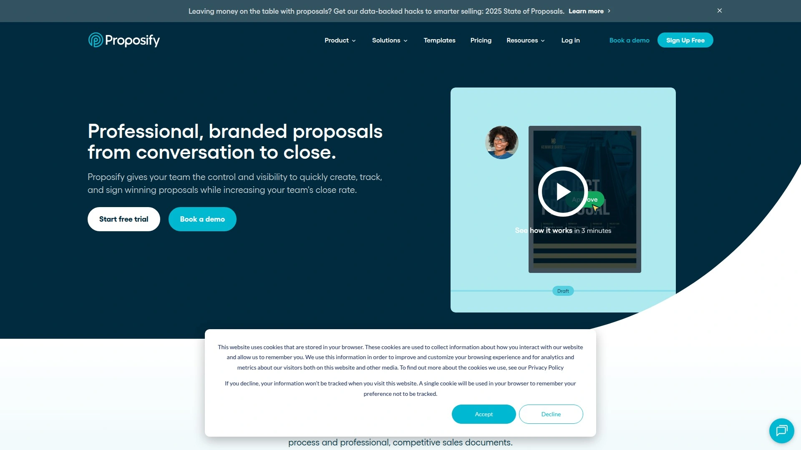

Proposify focuses exclusively on the proposal workflow, refining every feature to help sales teams win more business. Design-friendly templates let non-designers create visually impressive proposals that elevate your brand compared to basic Word documents. Drag-and-drop editing makes customization quick, allowing reps to personalize each proposal without starting from scratch.

Interactive pricing tables let prospects select options and see totals update in real-time, creating engagement and giving them control over the configuration. Standardized, pre-approved content minimizes the approval process while ensuring reps send error-free documents. Notifications alert you immediately when prospects open proposals, providing perfect timing for follow-up calls.

Multi-currency support presents proposals in local currencies for international clients, avoiding confusion and making pricing transparent. Content library stores reusable line items, images, and text blocks that teams can drag into any proposal. Analytics show which proposal sections prospects spend the most time on, revealing what resonates. Team plan costs $49/user monthly with custom pricing for larger organizations.

## [Better Proposals](https://betterproposals.io)

A proposal creation platform with extensive template library and straightforward editor for quickly producing professional sales documents.

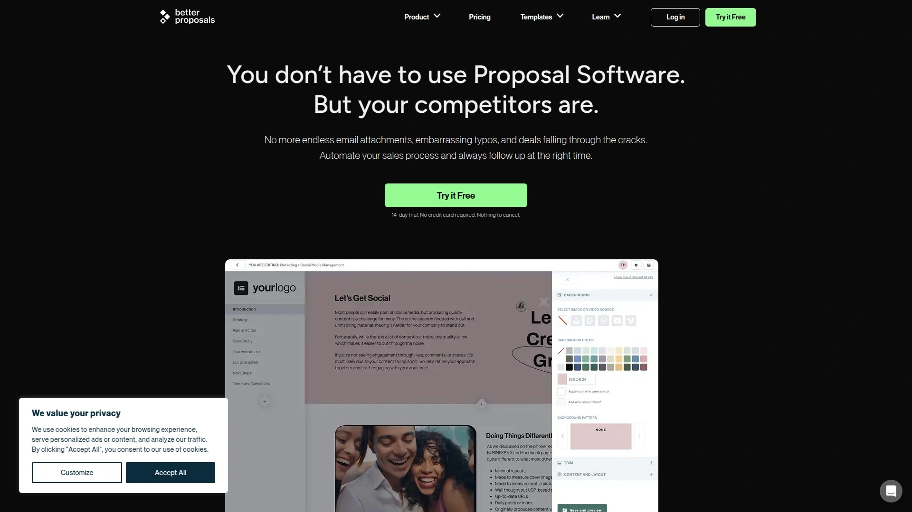

Better Proposals provides ready-to-use templates covering dozens of industries and use cases, letting you start with proven designs rather than blank pages. The platform emphasizes speed, allowing most users to create and send proposals in under 20 minutes. Customization options ensure templates match your brand without requiring design skills.

Proposal metrics track opens, views, and time spent, providing visibility into prospect engagement. E-signature capture turns accepted proposals into signed contracts without additional tools. Integration with payment processors lets clients pay deposits or full amounts immediately upon signing.

The editor balances simplicity with flexibility, giving you control without overwhelming you with options. Pricing starts at similar levels to Proposify, positioning it as a direct competitor in the mid-market segment. Twenty-four-seven support through chat provides help when you need it.

## [Qwilr](https://qwilr.com)

A modern proposal platform transforming static PDFs into interactive web pages with embedded calculators, pricing tables, and rich analytics.

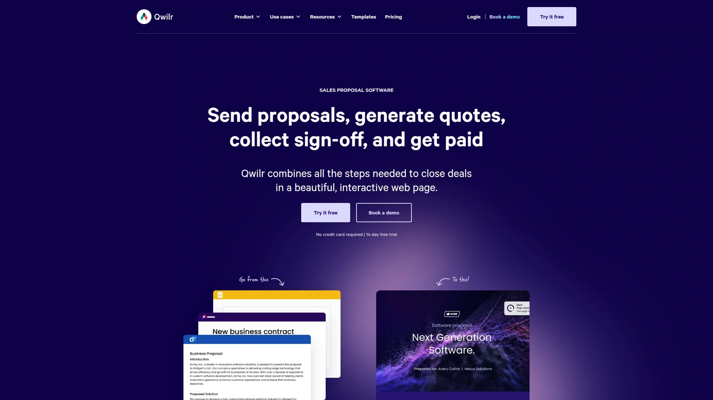

Qwilr reimagines proposals as dynamic web experiences rather than downloadable documents. Interactive elements like ROI calculators let prospects input their own numbers and see projected value, making benefits tangible. Pricing tables with selectable add-ons give buyers the ability to configure solutions themselves, increasing engagement and ownership.

Engagement scoring provides proprietary metrics showing how deeply prospects interact with your content, helping prioritize follow-ups. Page-level analytics reveal which sections capture attention and where prospects drop off, informing content optimization. Real-time notifications tell you immediately when prospects view documents, including their location and how long they spend on each page.

Advanced security options protect sensitive information through password access and automatic expiration dates. Document signing and payment collection happen within the web page, creating a seamless path from proposal to closed deal. Implementation is notably fast compared to other proposal tools, with most teams up and running quickly. Fourteen-day free trial lets you test capabilities before committing.

## [Oneflow](https://oneflow.com)

A contract management platform with truly interactive documents that both parties can edit collaboratively, plus built-in AI features.

Oneflow differentiates itself through interactive contracts that function more like collaborative documents than static PDFs. Both parties can make edits, suggest changes, and negotiate terms directly within the platform rather than exchanging multiple versions via email. Version control tracks every modification with timestamps and author attribution.

AI features assist with contract creation, field population, and clause suggestions based on past agreements. Single sign-on simplifies authentication for enterprise users. Free plan provides genuine functionality without time limits, letting small teams start using the platform immediately.

Integrations connect with CRMs and productivity tools to maintain data synchronization. Custom branding ensures contracts match your company identity. The platform targets the space between simple e-signature tools and complex enterprise contract lifecycle management systems.

## [Ironclad](https://ironcladapp.com)

An AI-powered contract lifecycle management platform designed for legal teams managing high volumes of agreements across the entire organization.

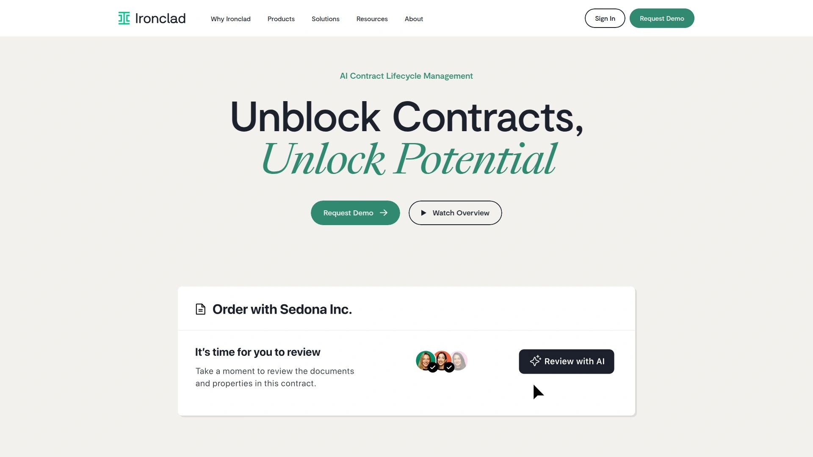

Ironclad uses artificial intelligence to transform how legal departments handle contracts from initial request through renewal. AI analyzes incoming contracts to flag risky clauses, suggest preferred language, and identify deviations from standard terms. Automated contract turnaround speeds up the process by routing documents through appropriate reviewers based on contract type, value, and complexity.

Collaboration happens through comments and notifications directly within the platform, eliminating email threads and version confusion. Slack integration provides updates on contract status without requiring users to log into a separate system. All contract data lives in secure infrastructure with encryption during transfer, storage, and processing.

Workflow templates standardize how different contract types move through approval chains, ensuring consistency while accommodating variations. Analytics provide visibility into contract velocity, bottlenecks, and team workload. The platform serves mid-sized to large companies with legal teams managing substantial contract volumes.

## [Conga](https://conga.com)

A comprehensive revenue lifecycle platform providing document automation, contract management, and CPQ for complex sales organizations.

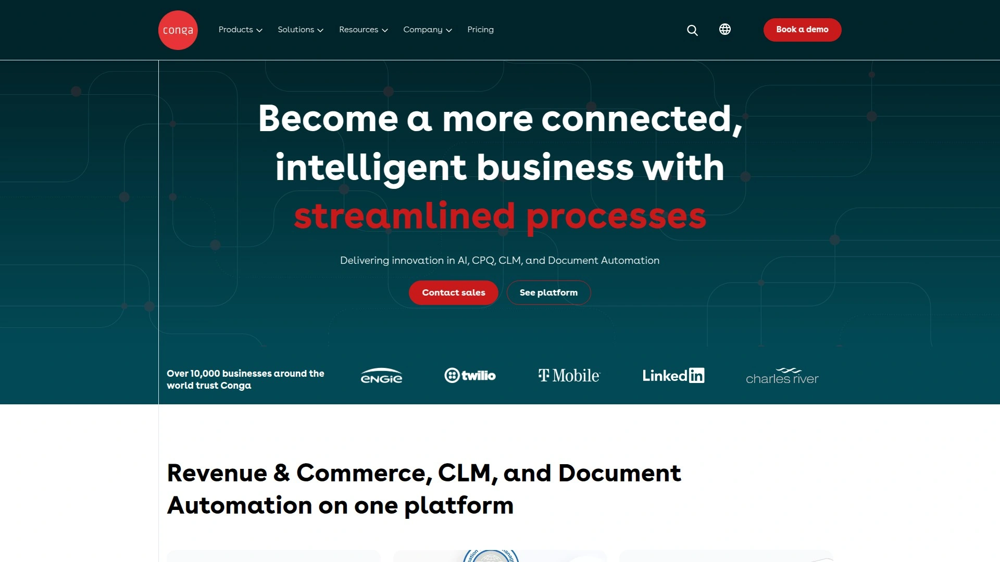

Conga excels at managing complicated sales processes with multiple products, pricing tiers, and approval requirements. CPQ functionality configures products, calculates accurate pricing including discounts and bundles, and generates quotes automatically. Document generation pulls data from Salesforce and other systems to create customized contracts, proposals, and agreements without manual data entry.

Contract lifecycle management tracks agreements from creation through renewal, maintaining version history and flagging important dates. Automated workflows route documents for internal approval before they reach customers, enforcing governance without creating delays. Deep Salesforce integration makes Conga a natural extension of that ecosystem.

Analytics and custom reporting provide insights into sales operations, contract performance, and revenue metrics. The platform targets larger enterprises with complex sales processes rather than small businesses needing basic functionality. Twenty-four-seven support serves global operations across time zones.

## [Juro](https://juro.com)

An AI-enabled contract automation platform allowing legal and business teams to create, negotiate, and manage agreements faster.

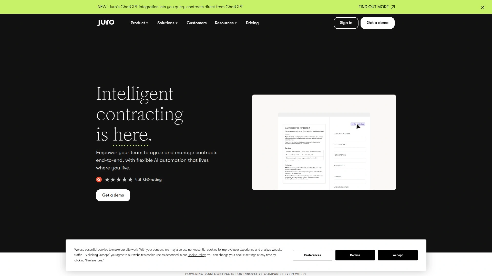

Juro automates repetitive contract tasks that consume legal team bandwidth, freeing attorneys to focus on strategic work. Natural language Q&A uses AI to populate contract fields based on simple questions, eliminating manual data entry. Standardized clause libraries ensure consistency across contracts while allowing customization when needed.

Version control tracks every change with complete history, preventing confusion about which draft is current. Document library centralizes all contracts in searchable storage where teams can quickly find any agreement. Analytics report on contract performance, cycle times, and bottlenecks.

Real-time collaboration allows legal, sales, and other stakeholders to work together on contracts simultaneously. The platform serves medium to large companies and law firms rather than solopreneurs or very small teams. Integration with CRMs keeps contract data synchronized with sales pipelines.

## [AirSlate](https://www.airslate.com)

A comprehensive workflow automation platform combining document generation, e-signatures, and no-code process automation bots.

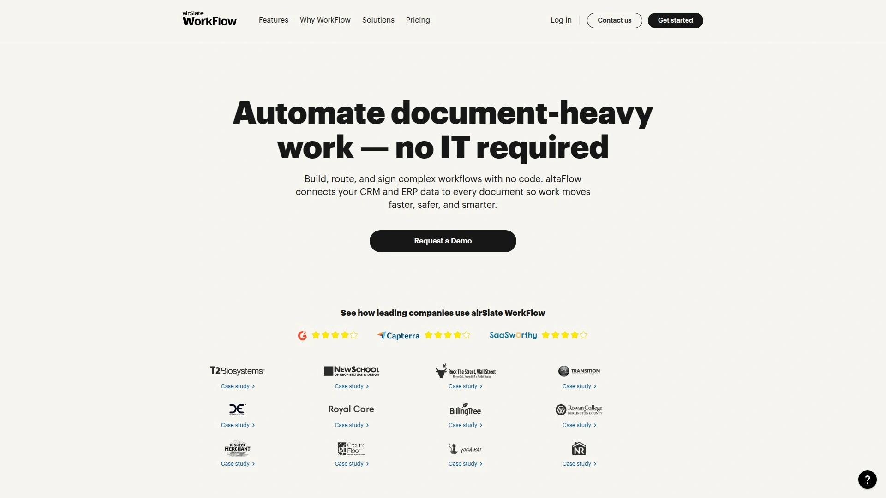

AirSlate provides end-to-end workflow automation extending far beyond simple document signing. No-code bots automate repetitive tasks like data extraction, conditional routing, and file archiving without requiring programming skills. Workflow library offers thousands of pre-built templates for common business processes that you can implement immediately.

Document generation creates contracts, invoices, and reports by merging data from forms, CRMs, and databases. E-signature functionality captures legally binding signatures as part of larger automated workflows. Conditional routing sends documents to different approvers based on content, amount, or other criteria.

Native integrations connect to Salesforce, Google Suite, Office 365, and other platforms without custom development. Bulk send distributes documents to large recipient lists with personalized content for each. Pricing starts at $19 monthly, making it accessible for smaller organizations. The platform positions itself as an all-in-one solution replacing multiple point tools.

## [Formstack](https://www.formstack.com)

A versatile forms and document platform combining data collection, document generation, and e-signature capabilities for streamlined processes.

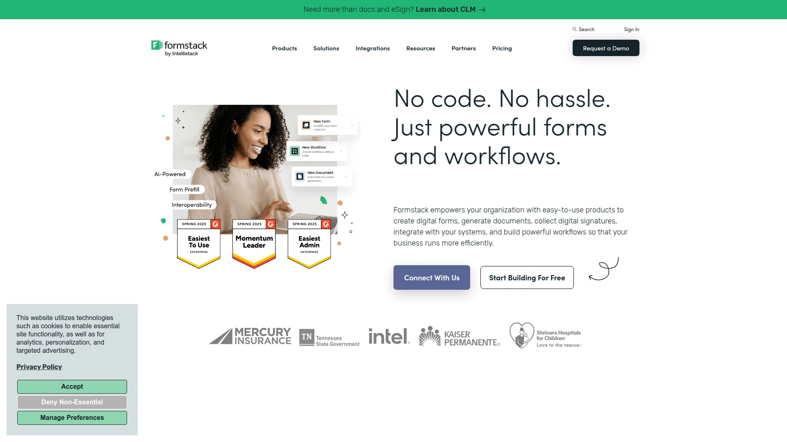

Formstack excels at capturing information through online forms and then using that data to automatically generate documents. No-code form builders create mobile-responsive forms without technical skills. Collected data integrates with CRMs, payment processors, and storage systems through hundreds of native connections.

Document generation merges form data into templates, creating personalized contracts, agreements, and reports automatically. E-signature functionality sends generated documents for signing, completing the process from data capture to executed agreement. Conditional logic shows or hides form fields based on previous responses, creating dynamic experiences.

HIPAA compliance makes it suitable for healthcare organizations handling protected information. Security features include SSO, audit logs, and role-based access controls. Plans separate products (Forms, Documents, Sign) or bundle them together. The platform serves organizations needing to digitize paper-based processes.

## [Signeasy](https://signeasy.com)

A mobile-first e-signature app focusing on simplicity and accessibility for users who need to sign documents on the go.

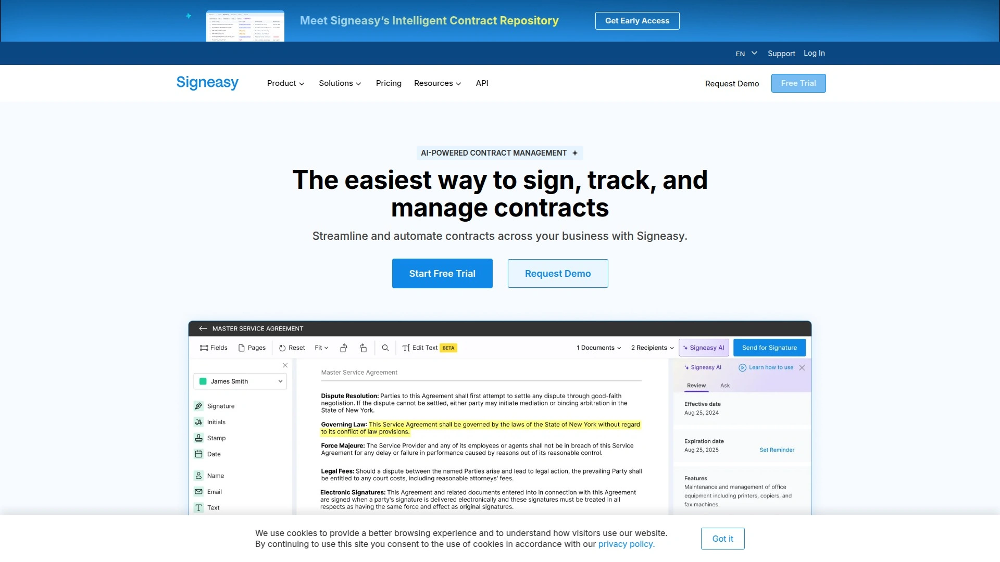

Signeasy prioritizes mobile experience, recognizing that many business professionals work primarily from smartphones and tablets. The app provides full functionality on iOS and Android without requiring desktop access. Simple interface minimizes learning curve, allowing new users to send and sign documents immediately.

Document preparation uses drag-and-drop fields to position signature blocks, dates, and other required information. Templates save frequently used documents for quick reuse. Cloud storage integration connects to Dropbox, Google Drive, and OneDrive for easy document access.

Offline signing captures signatures without internet connectivity, syncing automatically when connection returns. Audit trails document the signing process with timestamps and IP addresses. Pricing is competitive with other mid-market e-signature solutions.

## [Blueink](https://www.blueink.com)

A straightforward e-signature platform positioning itself as a cost-effective DocuSign alternative with transparent pricing and strong support.

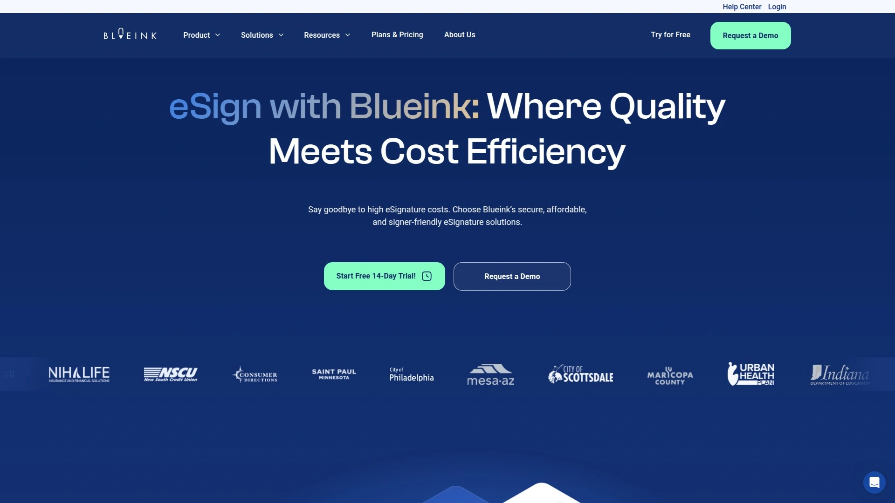

Blueink focuses on providing essential e-signature functionality at prices significantly below DocuSign, claiming 50% cost savings for comparable plans. Transparent pricing without hidden fees makes budgeting predictable. Enterprise-grade security includes 256-bit encryption and compliance with U.S. and EU e-signature laws.

Multi-party signing collects signatures from multiple participants with customizable signing orders. Automated reminders eliminate manual follow-up by sending notifications to pending signers. Document status tracking shows where each agreement sits in the signing process.

Certificate of Evidence captures detailed signing activity including timestamps, IP addresses, and authentication methods. Signer verification options include ID checks, email verification, and SMS passcodes. Unlimited plan provides massive value at $480 annually, suitable for high-volume users. HIPAA and GDPR compliance serves regulated industries.

## [Concord](https://www.concord.app)

An AI-powered contract management platform helping businesses track spending, negotiate smarter, and never miss renewal deadlines.

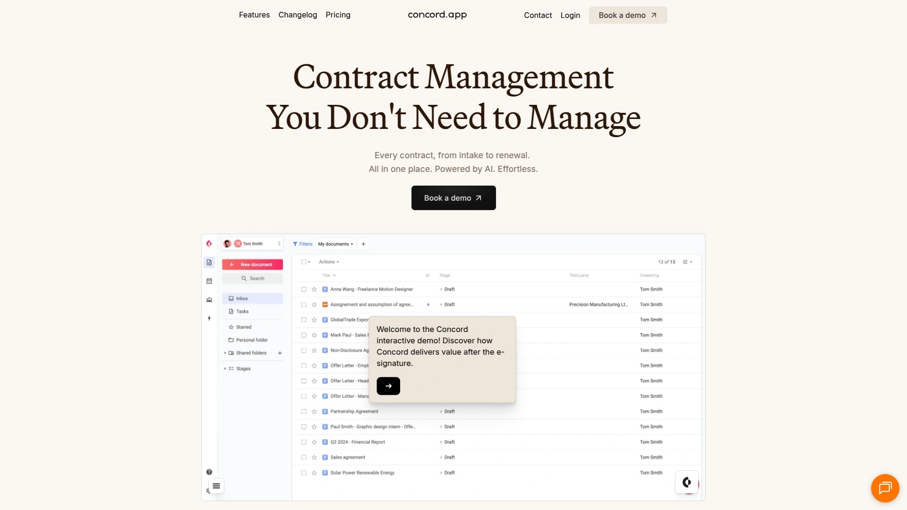

Concord combines e-signature with comprehensive contract lifecycle management. AI features analyze contract terms, flag unusual clauses, and provide negotiation suggestions. Deadline tracking alerts you before important dates like renewals, expirations, and milestone payments.

Unlimited e-signatures on all pricing plans remove caps on document volume. Spending analysis aggregates contract values to reveal total commitments and identify cost-saving opportunities. Collaboration tools let teams review, comment, and approve contracts before they're sent externally.

Contract repository centralizes all agreements in searchable storage with version history. The platform serves businesses wanting more than basic signing, providing strategic contract intelligence. Pricing tiers accommodate various company sizes from startups to mid-market.

## [Docubee](https://www.docubee.com)

A simple contract automation platform streamlining the entire contract lifecycle from creation through signature and storage.

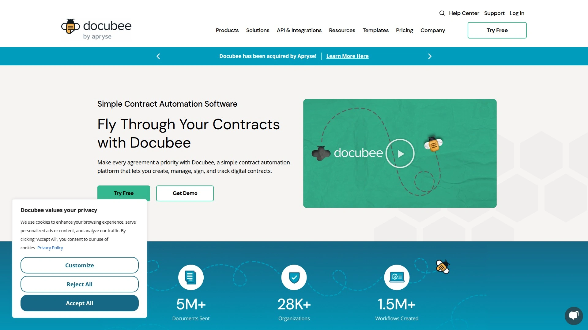

Docubee provides end-to-end contract automation in an accessible package. AI-assisted contract creation accelerates drafting by suggesting language and populating fields automatically. Templates offer starting points for common agreement types.

Real-time collaboration lets internal and external participants review, edit, and redline contracts simultaneously. Workflow automation routes documents through approval chains without manual intervention. E-signatures capture legally binding agreement on any device.

Contract management organizes all documents with tracking throughout their lifecycle. Payment integration collects funds as part of the signing process. API and webhook capabilities enable custom integrations with existing systems. Security features ensure HIPAA and SOC 2 Type II compliance.

## [SignWell](https://www.signwell.com)

A user-friendly e-signature tool with competitive pricing and straightforward features for teams needing reliable document signing.

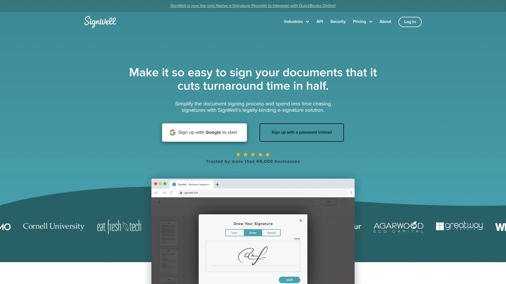

SignWell delivers essential e-signature functionality without unnecessary complexity. Reusable templates with pre-positioned fields speed up document preparation. Workflows available even on the free plan provide automation capabilities typically reserved for paid tiers on competing platforms.

Bulk sending handles large document batches efficiently, starting at just $12 monthly compared to competitors charging significantly more. Tamper-proof audit trails with downloadable reports document the signing process. Integration with 5,000+ apps through Zapier connects SignWell to your existing tools.

In-person signing accommodates scenarios where signers gather around a single device. Mobile signing works across devices without additional software. Free plan offers genuine functionality for users with limited needs, while paid plans start at affordable rates.

## [Bonsai](https://www.hellobonsai.com)

A comprehensive business management platform for freelancers combining contracts, proposals, invoicing, and client management in one tool.

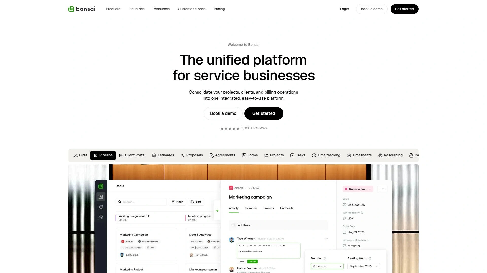

Bonsai serves freelancers and solo professionals with an all-in-one platform handling their entire client lifecycle. Legally vetted contract templates cover common freelance scenarios including general services, retainers, and project-specific work. Fill-in-the-blank approach lets you create professional contracts without legal expertise.

Proposals and contracts function as separate documents, allowing you to pitch work and then formalize agreements in distinct steps. Invoicing automates billing with recurring payment support for retainer clients. Payment processing through Stripe and PayPal enables immediate collection.

Email automation triggers messages based on specific events like contract signing or payment receipt. The platform separates proposals from contracts, giving you more control over each stage. Intuitive interface makes navigation easy even for users new to business management tools.

## [HoneyBook](https://www.honeybook.com)

An all-in-one business management platform designed specifically for creative professionals and independent businesses.

HoneyBook bundles proposals, contracts, invoices, and payment collection into unified packages sent to clients. This integrated approach reduces back-and-forth by presenting everything a client needs to review and accept in one place. Pre-loaded templates help creative professionals quickly generate professional-looking documents.

Automated workflows trigger actions at key moments, like sending invoices after contract signing or payment reminders before due dates. Client management centralizes communication, files, and project details. Scheduling tools coordinate meetings and availability.

Payment processing accepts credit cards, debit cards, and bank transfers. Recurring payments handle ongoing retainer relationships. The platform specifically serves creative businesses including photographers, designers, consultants, and event professionals.

## [Nintex](https://www.nintex.com)

An enterprise process automation platform with robust document generation, AI-powered document processing, and workflow management.

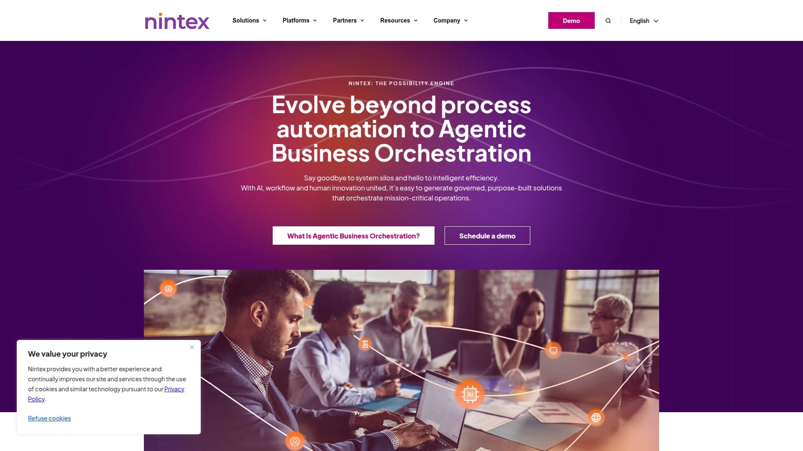

Nintex provides comprehensive process automation extending far beyond basic document tasks. AI-powered document processing extracts data from inbound documents like invoices, forms, and applications without manual entry. Text extraction, translation, summarization, and sentiment analysis happen automatically.

Document generation creates customized outputs including contracts, reports, quotes, and correspondence by merging data from multiple systems. Multi-language support produces documents in various languages automatically. E-signature routing sends generated documents for approval seamlessly.

Workflow automation connects document generation to broader business processes across departments. The platform targets large organizations with complex requirements rather than small businesses. Financial institutions, government agencies, and manufacturers use it for loan applications, permits, claims processing, and compliance documentation.

## [Eversign](https://eversign.com)

Now rebranded as Xodo Sign, this e-signature platform offers free and paid tiers with essential signing features.

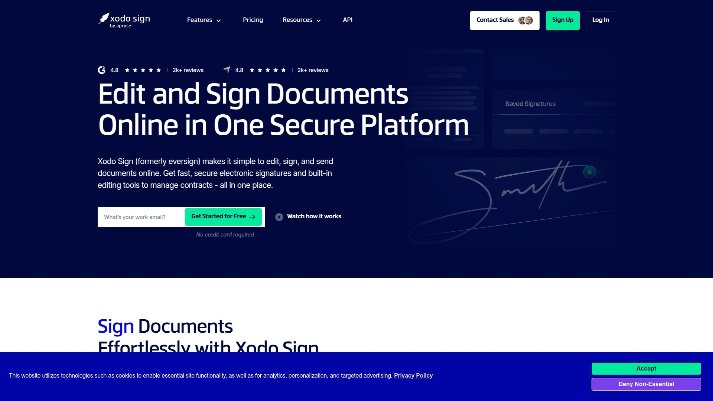

Xodo Sign provides straightforward e-signature functionality at competitive price points. Free tier offers genuine capabilities for users with limited signing needs. Paid plans add features like templates, team collaboration, and advanced authentication.

Document preparation positions signature fields, initials, dates, and form elements with drag-and-drop simplicity. Audit trails capture signing events with legal compliance. Mobile apps provide signing capabilities on smartphones and tablets.

Integration options connect to popular business tools through APIs and native connections. The platform serves small to medium businesses needing reliable signing without enterprise complexity.

## [ContractWorks](https://www.contractworks.com)

A dedicated contract management system focusing on secure storage, organization, and tracking of business agreements.

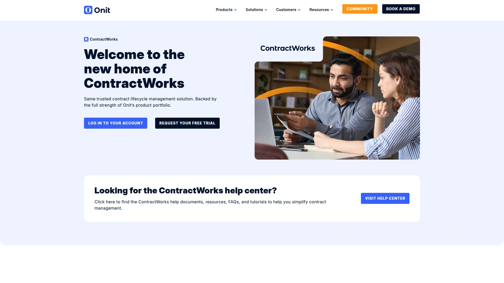

ContractWorks specializes in contract repository and management rather than creation or negotiation. Centralized storage keeps all contracts in one secure location with role-based access controls. Search functionality quickly locates specific agreements or clauses across thousands of documents.

Automated alerts notify stakeholders about upcoming renewals, expirations, and key dates. Version control tracks contract revisions with complete history. Reporting provides visibility into contract portfolios, values, and status.

The platform serves organizations needing to organize existing contracts and establish management processes. It complements rather than replaces document creation and e-signature tools.

***

### How do I choose between document automation and basic e-signature tools?

Basic e-signature tools work if you're only sending pre-written contracts for signature, but document automation platforms save significant time when you're creating proposals, quotes, or contracts from scratch repeatedly. If you're copying data from your CRM into documents manually or customizing pricing more than a few times weekly, automation pays for itself quickly through time savings.

### Can these platforms integrate with my existing CRM?

Most major document platforms integrate with Salesforce, HubSpot, Pipedrive, and other popular CRMs, syncing contact data automatically and updating deal stages when contracts are signed. Check the specific integration marketplace for your CRM before committing to ensure the connection supports your required workflows.

### What's the typical ROI timeline for document automation?

Most businesses see payback within 2-4 months through reduced document creation time, faster signature turnaround, and improved close rates. Teams report saving hours daily that previously went to copying data, chasing signatures, and fixing errors in manually created documents.

***

### Conclusion

Getting documents signed shouldn't be the hardest part of closing deals. The right platform eliminates bottlenecks by automating creation, tracking engagement, and capturing signatures without you needing to send reminder emails or check in constantly. For teams needing comprehensive functionality that handles everything from professional proposal creation through CPQ and signature collection, [PandaDoc](#pandadoc) delivers an integrated solution that speeds up sales cycles while providing the analytics to continuously improve your document performance and win rates.
